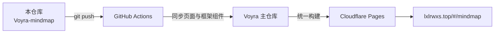

<div align="center">

# 🧠 Voyra · AI Agent 思维导图 · AI Agent Mind Map

**一张图看懂 AI Agent 的知识体系与学习路径 ｜ The AI Agent landscape as an explorable mind map**

[](https://github.com/liixnglinb/Voyra-mindmap/actions/workflows/sync-to-voyra.yml)


### [🌐 在线演示 Live Demo](https://lxlrwxs.top/#/mindmap) ｜ [🏠 Voyra 主站 Main Site](https://lxlrwxs.top) ｜ [📦 主仓库 Main Repo](https://github.com/liixnglinb/Voyra)

</div>

---

## 💡 这是什么 / What Is This

把 AI Agent 领域庞杂的概念、工具与学习/创作线索组织成一张**可交互的思维导图**：节点分层展开、缩放平移，帮助初学者建立整体框架，也方便实践者随时查阅知识脉络。

*Organizes the sprawling concepts, tools and learning paths of AI agents into one explorable, zoomable mind map — a mental framework for beginners and a quick reference for practitioners.*

## ✨ 功能特性 / Features

- **分层知识结构**：从核心概念到工具链、应用场景逐层展开。
  *Layered structure: core concepts → toolchain → use cases.*
- **沉浸式画布**：导图应用在独立画布中渲染，支持缩放、平移与节点展开。
  *The map renders in a dedicated full-screen canvas with zoom/pan/expand.*
- **暗色沉浸主题**：深色界面突出节点关系，长时间浏览不刺眼。
  *Dark immersive theme that highlights node relationships.*
- **壳架分离**：主站提供路由与鉴权外壳，导图内容独立维护、独立构建。
  *Clean separation: the main site provides the router/auth shell while the map is built independently.*

## 🛠 技术栈 / Tech Stack

| 类别 Category | 技术 Stack |
| --- | --- |
| 框架 Framework | React 18（Hooks） |
| 构建 Build | Vite 5（导图子应用独立构建产物） |
| 样式 Styling | Tailwind CSS |
| 嵌入 Embedding | iframe + 响应式容器组件 |
| 图标 Icons | lucide-react |

## 📁 目录结构 / Structure

```
src/
├── pages/
│   └── MindMap.jsx          # 路由页面薄壳：标题/鉴权/挂载框架 / Route shell
└── components/
    └── MindMapFrame.jsx     # 导图 iframe 容器：自适应/加载态/通信 / Frame
```

> 导图子应用的构建脚本（build-mindmap）保留在 Voyra 主仓库，由统一构建流程产出。
> *The mind-map sub-app build script stays in the main Voyra repo and runs in the unified build.*

## 🔗 与 Voyra 主仓库的关系 / How It Syncs

本仓库是 Voyra 个人工具中心「AI Agent 思维导图」模块的**独立源码仓库**：代码在本仓库维护，每次 `push` 由 GitHub Actions 自动同步到 Voyra 主仓库的相同路径，主仓库统一构建并部署到 Cloudflare Pages。

*Standalone source repo of the AI Agent Mind Map module. Every push is auto-synced into the main Voyra repository, which builds and deploys the whole site.*



## 🚀 本地开发 / Development

模块依赖主仓库共享层（路由、鉴权、通用组件），完整运行请克隆主仓库：

*Depends on the main repo's shared layer. Clone the main repo to run locally:*

```bash
git clone https://github.com/liixnglinb/Voyra.git
cd Voyra && npm install && npm run dev
```

## 📄 许可证 / License

MIT © [liixnglinb](https://github.com/liixnglinb)

## 🔍 关键词 / Keywords

AI Agent 思维导图 人工智能体 知识图谱 学习路径 Agent框架 大模型 ｜ ai agent mind map knowledge graph learning path llm agents overview react
